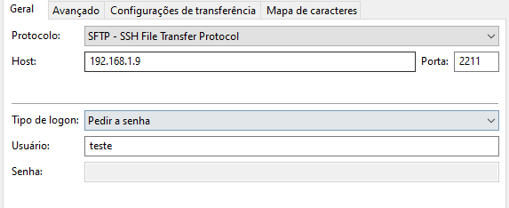

# Criar USUARIO SFTP
> Script em SHELL para criar usuarios SFTP

## Aviso
    - O grupo SFTP deve ser chamado 'sftp'

## Uso:
    - chmod +x criarUser.sh
    - ./criarUser.sh

## Demonstração:

![Filezilla]
(/demo/filezillaInfo.png "Filezilla")
(/demo/filezillaLog.png "Filezilla")
![Cmd]
(/demo/cmd.png "Cmd")
